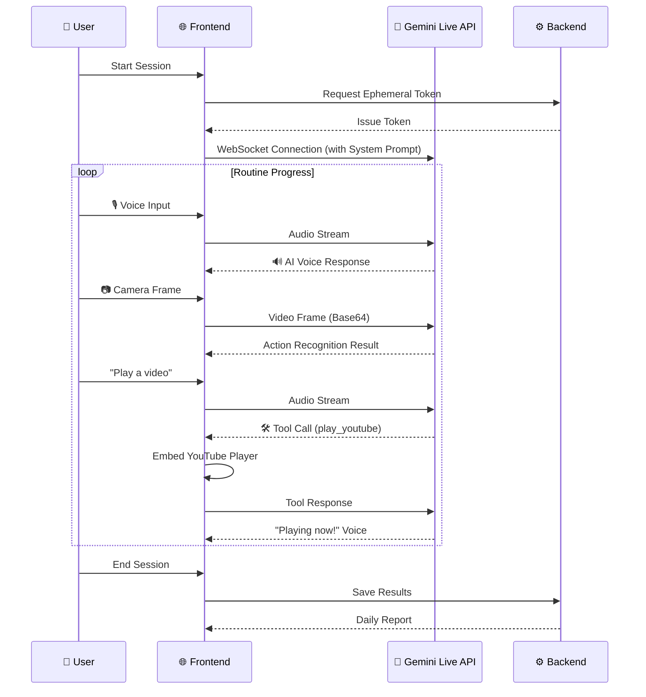
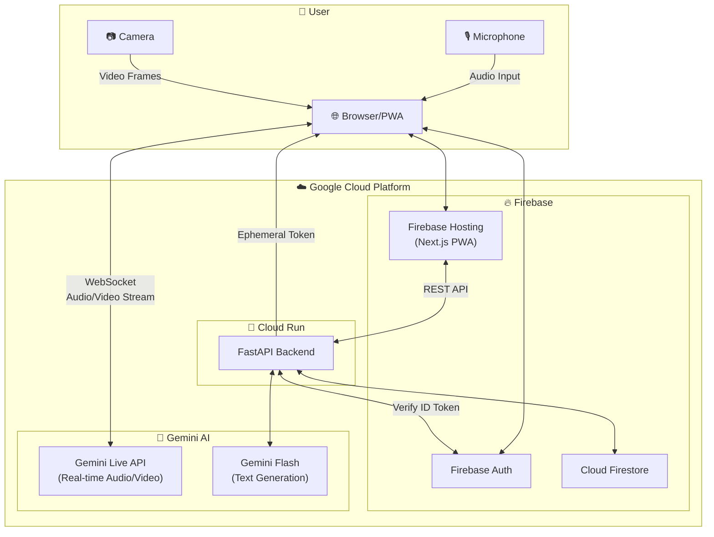

# ⚡ SparkWake - AI Morning Coach

> **Google Gemini Live Agent Challenge** - Live Agents 🗣️ Category
<br/>

## 💥 Your AI Morning Routine Coach!

**Struggling with morning routines? 😴 → ⚡ SPARK! Let's do this!!!**

We've all been there... Playing yoga videos but scrolling your phone instead... 
Saying "I'll stretch" while lying in bed... 🫠
It's just too hard to do it alone!

That's why we built SparkWake!
**An AI coach that actually talks to you, sees you, and does your routine with you!**
<br/>

## 🎬 Demo Video

[](https://youtu.be/QnaA6KU3_28)

[📺 Watch Demo on YouTube](https://youtu.be/QnaA6KU3_28)
<br/>

## ✨ Why SparkWake?

> "Morning routines alone? Now with your AI coach!" 🔥

| Feature | Description |
|---------|-------------|
| 🎙️ **Real-time Voice** | Natural two-way voice conversation |
| 👁️ **Vision Recognition** | Camera-based action detection & auto-verification |
| 🔊 **Barge-in Support** | Interrupt AI anytime during conversation |
| 🎬 **Tool Calling** | "Play a video" → AI plays YouTube |
| 🧘 **Personalized Coaching** | Friendly morning coach persona |
<br/>

## 🏆 Hackathon Criteria Checklist

| Criteria | Implementation | Status |
|----------|----------------|--------|
| **Interruption Handling** | AudioPlayer.clear() on user speech | ✅ |
| **Distinct Persona/Voice** | Friendly morning coach in English | ✅ |
| **Real-time Audio** | Gemini Live API WebSocket streaming | ✅ |
| **Real-time Vision** | Video frame analysis for action verification | ✅ |
<br/>

## 🛠️ Tech Stack

| Layer | Technology |
|-------|------------|
| **AI** | Gemini Live API (`gemini-2.5-flash-native-audio-preview`) |
| **Frontend** | Next.js 15, TypeScript, Tailwind CSS, PWA |
| **Backend** | FastAPI, Python 3.12 |
| **Database** | Cloud Firestore |
| **Auth** | Firebase Authentication |
| **Hosting** | Firebase Hosting (FE) + Cloud Run (BE) |
| **IaC** | Terraform |
<br/>

## 🤖 How the Live Agent Works

SparkWake's AI agent operates in real-time through the **Gemini Live API**.

### Agent Flow



### Agent Capabilities

| Feature | Implementation | Code Location |
|---------|---------------|---------------|
| **Real-time Voice Chat** | WebSocket + PCM16 Audio Streaming | `lib/gemini-live.ts` |
| **Barge-in (Interruption)** | `onInterrupted` → `AudioPlayer.clear()` | `LiveSessionContext.tsx` |
| **Video Recognition** | Canvas → Base64 JPEG → Live API | `CameraPreview.tsx` |
| **Tool Calling** | Function Declaration + `sendToolResponse()` | `LiveSessionContext.tsx` |
| **Persona** | Coach character defined in System Prompt | `LiveSessionContext.tsx` |

### Defined Tools (Function Calling)

```typescript
const tools = [{
  functionDeclarations: [
    {
      name: "play_youtube",
      description: "Play a YouTube video",
      parameters: { videoId: string, query: string }
    },
    {
      name: "complete_routine",
      description: "Mark current routine as complete"
    },
    {
      name: "skip_routine", 
      description: "Skip current routine"
    }
  ]
}]
```

### System Prompt (Agent Persona)

```
You are a Miracle Morning AI Coach. 
- Speak in short, friendly sentences
- Guide users through their morning routines
- Use play_youtube when user asks for videos
- Say "Mission complete!" when video verification succeeds
- Be encouraging and supportive! 💪
```
<br/>

## 🎯 Core Features

### 1. Real-time Voice Coaching 🎙️
```
[Routine Start] → AI: "Great! Ready to start stretching?"
[User]: "I'm feeling tired today..."
[AI]: "That's okay! Let's just do 5 minutes. I'll be with you!"
```

### 2. Video Verification 👁️
```
[AI]: "Wave your hand at the camera!"
[User waves hand]
[AI]: "Awesome! Mission complete! 💪"
```

### 3. AI Tool Calling 🎬
```
[User]: "Play a yoga video"
[AI]: Calls play_youtube() → YouTube embed appears
[AI]: "Here's your morning yoga video! Let's follow along~"
```

### 4. Daily Report 📊
- Completion/skip status per routine
- Overall completion rate
- AI coaching message
<br/>

## 📁 Project Structure

```
SparkWake/
├── frontend/          # Next.js PWA
│   ├── src/
│   │   ├── app/       # Pages (Home, Session, Report, Profile)
│   │   ├── components/# UI Components
│   │   ├── contexts/  # Auth, LiveSession Context
│   │   └── lib/       # Gemini Live API Client
├── backend/           # FastAPI Server
│   └── app/
│       ├── routers/   # API Endpoints
│       └── services/  # Gemini, Firestore, Auth
├── infra/             # Terraform IaC
└── aidlc-docs/        # Design Documents
```
<br/>

## 🚀 Quick Start

### Prerequisites
- Node.js 18+
- Python 3.12+
- Firebase Project
- Google Cloud Project with Gemini API enabled

### 1. Clone & Setup
```bash
git clone https://github.com/your-username/sparkwake.git
cd sparkwake
```

### 2. Backend
```bash
cd backend
python -m venv venv
source venv/bin/activate
pip install -r requirements.txt

# Set environment variables
export GEMINI_API_KEY=your_api_key
export GOOGLE_CLOUD_PROJECT=your_project_id

uvicorn app.main:app --reload --port 8000
```

### 3. Frontend
```bash
cd frontend
npm install

# Copy and edit .env.local
cp .env.local.example .env.local

npm run dev
```

### 4. Open Browser
```
http://localhost:3000
```
<br/>

## ☁️ Google Cloud Deployment

### Architecture



### Deploy with Terraform
```bash
cd infra
terraform init
terraform plan
terraform apply
```
<br/>

## 🔐 Security

- API keys stored in environment variables / Secret Manager
- Firebase ID Token verification on all API calls
- CORS restricted to production domains
- No sensitive data in logs
<br/>

## 📈 Future Improvements

- [ ] Connection pooling for cost optimization
- [ ] Weekly/Monthly analytics with Gemini 3.1 Pro
- [ ] Multi-language support
- [ ] Social features (friends, challenges)
<br/>

## 👨‍💻 Team

Built with ❤️ for Google Gemini Live Agent Challenge
<br/>

## 📄 License

MIT License
