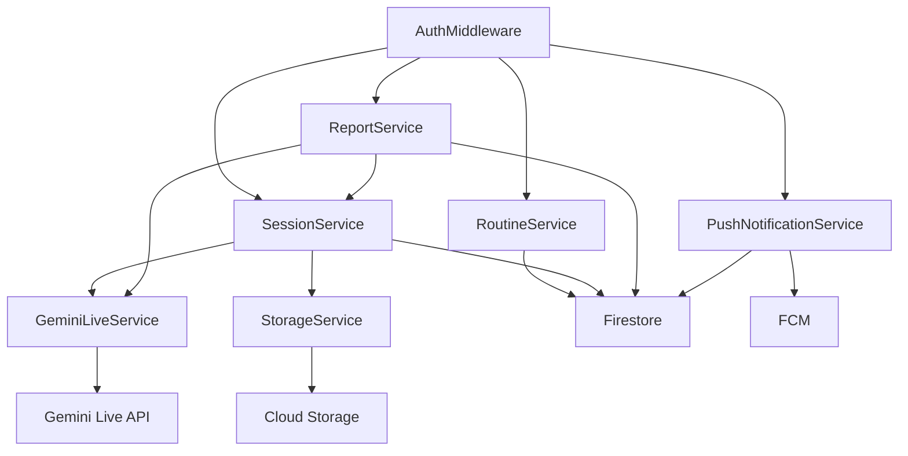

# Services Architecture

## 서비스 개요

```
┌─────────────────────────────────────────────────────────────┐
│                      Frontend (Next.js PWA)                  │
│  ┌─────────┐ ┌─────────┐ ┌─────────┐ ┌─────────┐           │
│  │  Auth   │ │ Routine │ │  Live   │ │  Report │           │
│  │Provider │ │ Manager │ │ Session │ │  View   │           │
│  └────┬────┘ └────┬────┘ └────┬────┘ └────┬────┘           │
└───────┼───────────┼───────────┼───────────┼─────────────────┘
        │           │           │           │
        ▼           ▼           ▼           ▼
┌─────────────────────────────────────────────────────────────┐
│                    Backend API (FastAPI)                     │
│  ┌─────────────────────────────────────────────────────┐   │
│  │                   AuthMiddleware                     │   │
│  └─────────────────────────────────────────────────────┘   │
│  ┌─────────┐ ┌─────────┐ ┌─────────┐ ┌─────────┐          │
│  │ Routine │ │ Session │ │ Gemini  │ │ Report  │          │
│  │ Service │ │ Service │ │  Live   │ │ Service │          │
│  └────┬────┘ └────┬────┘ └────┬────┘ └────┬────┘          │
│       │           │           │           │                 │
│  ┌────┴───────────┴───────────┴───────────┴────┐           │
│  │              Storage Service                 │           │
│  │              Push Notification Service       │           │
│  └──────────────────────────────────────────────┘           │
└─────────────────────────────────────────────────────────────┘
        │           │           │           │
        ▼           ▼           ▼           ▼
┌─────────────────────────────────────────────────────────────┐
│                   External Services                          │
│  ┌─────────┐ ┌─────────┐ ┌─────────┐ ┌─────────┐           │
│  │Firebase │ │Firestore│ │ Cloud   │ │ Gemini  │           │
│  │  Auth   │ │         │ │ Storage │ │Live API │           │
│  └─────────┘ └─────────┘ └─────────┘ └─────────┘           │
└─────────────────────────────────────────────────────────────┘
```

---

## 서비스 정의

### 1. Authentication Service
**역할**: 사용자 인증 및 권한 관리

**흐름**:
```
1. 사용자 → Frontend (signInAnonymously/signInWithGoogle)
2. Frontend → Firebase Auth (인증 요청)
3. Firebase Auth → Frontend (ID Token 반환)
4. Frontend → Backend API (ID Token 포함)
5. Backend AuthMiddleware → Firebase Admin (토큰 검증)
6. Backend → Frontend (인증된 응답)
```

### 2. Routine Management Service
**역할**: 루틴 CRUD 및 설정 관리

**흐름**:
```
1. 사용자 → RoutineManager (루틴 생성/수정/삭제)
2. RoutineManager → Backend API (/api/routines)
3. RoutineService → Firestore (데이터 저장)
4. Firestore → RoutineService (결과 반환)
5. Backend API → RoutineManager (응답)
```

### 3. Live Session Service
**역할**: 실시간 AI 음성/비디오 세션 관리

**흐름**:
```
1. 푸시 알림 클릭 → PWA 열림
2. LiveSessionController → Backend (/api/session/start)
3. SessionService → GeminiLiveService (Live API 세션 생성)
4. GeminiLiveService ↔ Gemini Live API (WebSocket 연결)
5. Frontend ↔ Backend (오디오/비디오 스트리밍)
6. Gemini Live API → Backend (응답/인식 결과)
7. Backend → Frontend (실시간 응답)
```

### 4. Video Verification Service
**역할**: 실시간 비디오 행동 인식

**흐름**:
```
1. 루틴 시작 → VideoVerificationView (카메라 활성화)
2. VideoVerificationView → LiveSessionController (비디오 프레임 전송)
3. LiveSessionController → Backend (프레임 스트리밍)
4. GeminiLiveService → Gemini Live API (행동 인식 요청)
5. Gemini Live API → GeminiLiveService (인식 결과)
6. Backend → Frontend (인증 완료/음성 칭찬)
7. SessionService → Firestore (결과 기록)
8. StorageService → Cloud Storage (스냅샷 저장)
```

### 5. Report Service
**역할**: 일일 리포트 생성 및 조회

**흐름**:
```
1. 모든 루틴 완료 → SessionService (세션 종료)
2. SessionService → ReportService (리포트 생성 요청)
3. ReportService → Firestore (세션 데이터 조회)
4. ReportService (통계 계산)
5. ReportService → Firestore (리포트 저장)
6. ReportService → GeminiLiveService (음성 요약 생성)
7. Backend → Frontend (리포트 + 음성 요약)
```

### 6. Push Notification Service
**역할**: 기상 알람 푸시 알림

**흐름**:
```
1. 사용자 → PWAManager (푸시 권한 허용)
2. PWAManager → Backend (/api/push/register)
3. PushNotificationService → Firestore (FCM 토큰 저장)
4. Cloud Scheduler → Backend (/api/push/trigger) [기상 시간]
5. PushNotificationService → FCM (알림 발송)
6. FCM → 사용자 디바이스 (푸시 알림)
7. 사용자 클릭 → PWA 열림 → Live Session 시작
```

---

## API 엔드포인트 설계

### REST API

| Method | Endpoint | 설명 |
|--------|----------|------|
| POST | /api/auth/verify | 토큰 검증 |
| GET | /api/routines | 루틴 목록 조회 |
| POST | /api/routines | 루틴 생성 |
| PUT | /api/routines/{id} | 루틴 수정 |
| DELETE | /api/routines/{id} | 루틴 삭제 |
| POST | /api/session/start | 세션 시작 |
| POST | /api/session/end | 세션 종료 |
| POST | /api/session/complete | 루틴 완료 |
| POST | /api/session/skip | 루틴 스킵 |
| GET | /api/reports/{date} | 일일 리포트 조회 |
| POST | /api/push/register | FCM 토큰 등록 |
| DELETE | /api/push/unregister | FCM 토큰 해제 |

### WebSocket API

| Endpoint | 설명 |
|----------|------|
| /ws/live | Gemini Live API 프록시 (오디오/비디오 스트리밍) |

---

## 서비스 간 의존성


