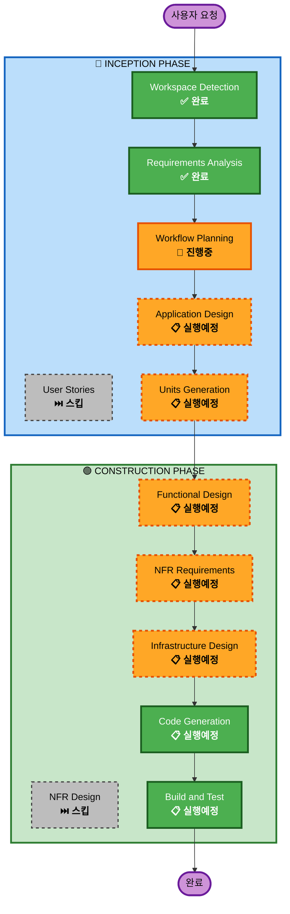

# Execution Plan

## 상세 분석 요약

### 프로젝트 유형
- **Type**: Greenfield (새 프로젝트)
- **Category**: Live Agents (Real-time Audio/Vision)
- **Complexity**: Moderate-Complex

### 변경 영향 평가
- **사용자 영향**: Yes - 전체 사용자 경험 (음성 대화, 비디오 인증)
- **구조적 변경**: Yes - 새로운 시스템 아키텍처 설계
- **데이터 모델 변경**: Yes - 루틴, 세션, 리포트 스키마 설계
- **API 변경**: Yes - 새로운 REST API + WebSocket 엔드포인트
- **NFR 영향**: Yes - 실시간 성능, 보안, 확장성

### 위험 평가
- **위험 수준**: Medium
- **근거**: 실시간 멀티모달 AI 통합은 복잡하지만, Gemini Live API가 잘 문서화되어 있음
- **롤백 복잡도**: Easy (Greenfield이므로 롤백 불필요)
- **테스트 복잡도**: Moderate (Live API 모킹 필요)

---

## 워크플로우 시각화



---

## 실행할 단계

### 🔵 INCEPTION PHASE
| 단계 | 상태 | 근거 |
|------|------|------|
| Workspace Detection | ✅ 완료 | Greenfield 확인 |
| Requirements Analysis | ✅ 완료 | 13개 요구사항 정의 |
| User Stories | ⏭️ 스킵 | 1주 타이트한 일정, 요구사항이 충분히 상세함 |
| Workflow Planning | 🔄 진행중 | 실행 계획 수립 |
| Application Design | 📋 실행 | 새 컴포넌트/서비스 설계 필요 |
| Units Generation | 📋 실행 | Frontend/Backend/Infra 분리 필요 |

### 🟢 CONSTRUCTION PHASE
| 단계 | 상태 | 근거 |
|------|------|------|
| Functional Design | 📋 실행 | 비즈니스 로직 상세 설계 필요 |
| NFR Requirements | 📋 실행 | 실시간 성능, 보안 요구사항 정의 |
| NFR Design | ⏭️ 스킵 | NFR Requirements에서 충분히 커버 |
| Infrastructure Design | 📋 실행 | Terraform IaC 설계 필요 |
| Code Generation | 📋 실행 | 항상 실행 |
| Build and Test | 📋 실행 | 항상 실행 |

---

## 예상 Unit of Work 구조

```
miracle-morning-coach/
├── Unit 1: Frontend (Next.js PWA)
│   ├── 인증 UI
│   ├── 루틴 설정 UI
│   ├── 실시간 세션 UI (음성 + 비디오)
│   └── 리포트 UI
│
├── Unit 2: Backend (FastAPI)
│   ├── Auth API
│   ├── Routine API
│   ├── Session API
│   ├── Report API
│   └── Gemini Integration
│
└── Unit 3: Infrastructure (Terraform)
    ├── Cloud Run
    ├── Firestore
    ├── Cloud Storage
    └── Firebase Hosting
```

---

## 예상 타임라인

| 단계 | 예상 소요 |
|------|----------|
| Application Design | 30분 |
| Units Generation | 20분 |
| Functional Design | 1시간 |
| NFR Requirements | 30분 |
| Infrastructure Design | 30분 |
| Code Generation | 3-4일 |
| Build and Test | 1일 |
| **총 예상** | **5-6일** |

---

## 성공 기준

### 주요 목표
- Google Gemini Live Agent Challenge 해커톤 제출 가능한 완성된 PWA

### 핵심 산출물
- 동작하는 PWA (음성 알람 + 비디오 인증)
- Terraform IaC 코드
- 4분 데모 영상
- 아키텍처 다이어그램
- README 배포 가이드

### 품질 게이트
- Live API 실시간 응답 < 500ms
- 비디오 인증 정확도 > 80%
- 심사위원이 `terraform apply`로 즉시 배포 가능
